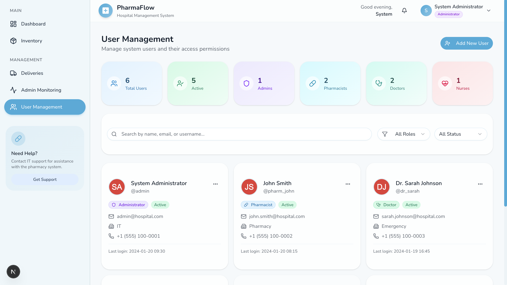

# PharmaFlow
Hospital Pharmacy and Drug Distribution Management System

## Project Overview

This system manages hospital pharmacy inventory and internal drug distribution. It allows doctors or nurses to request medication for patients while pharmacists manage stock and approve requests. The system ensures drugs are delivered directly to hospital departments such as the Operating Room, Labor Room, ICU, or patient rooms, reducing delays and improving patient care.

## Problem

In many hospitals, patients must personally collect medication from the pharmacy. This can cause delays, inconvenience, and risk of medication errors. Additionally, manual tracking of inventory can lead to stock inaccuracies and expired drug usage.

## Objectives

* Automate pharmacy inventory management
* Enable internal drug request and delivery workflow
* Track medication distribution within the hospital
* Monitor drug expiry and reduce medication waste

---

## System Features

### 1. Inventory Management

* Add, update, and remove drug records
* Track stock quantities and batches

### 2. Expiry Alert System

* Detect near-expiry or expired drugs
* Prevent expired drugs from being dispatched

### 3. Drug Request System

* Doctors or nurses submit drug requests using patient ID
* Select delivery location (Operating Room, Labor Room, ICU, Patient Room)

### 4. Distribution Tracking

* Track request status: Requested → Approved → Dispatched → Delivered
* Log delivery time and responsible staff

### 5. Audit & Reporting

* Track drug handling history
* Generate inventory and usage reports

---

## System Architecture Overview

1. Users log in and access role-based dashboards.
2. Doctors or nurses submit drug requests.
3. Pharmacists review and approve requests.
4. Inventory updates automatically and drugs are dispatched.
5. All actions are logged for auditing.

## Architecture

The system follows a layered architecture:

* Presentation Layer (React UI)
* Application Layer (Node.js business logic)
* Data Access Layer (API and database queries)
* Database Layer (MySQL storage)

## Security

* Secure login with password hashing
* JWT-based authentication
* Role-based access control

---

## User Roles & Permissions

### Pharmacists
- Manage inventory  
- Approve/reject drug requests  
- Track deliveries 


### Doctors
- Prescribe drugs  
- Submit drug requests  

### Nurses
- Input patient information  
- Confirm medication status  

### Administrators
- Manage users  
- Monitor reports 
 

---

## Technology Stack

* Frontend: React.js
* Backend: Node.js with Express.js
* Database: MySQL
* Authentication: JWT and bcrypt


## 🛠️ Installation & Setup Instructions

### Clone Repository
```bash
git clone https://github.com/1stChaS/PharmaFlow.git
cd PharmaFlow

## Setup

### Backend
```bash
cd backend
cp .env.example .env
npm install
npm run dev
```

### Database (MySQL)
```bash
mysql -u root -p hospital_pharmacy < backend/database/001-create-tables.sql
mysql -u root -p hospital_pharmacy < backend/database/002-seed-data.sql
mysql -u root -p hospital_pharmacy < backend/database/003-add-patients-prescriptions.sql
mysql -u root -p hospital_pharmacy < backend/database/004-seed-role-features.sql
```

### Frontend
```bash
cd frontend
npm install
echo "NEXT_PUBLIC_API_URL=http://localhost:3001/api" > .env.local
npm run dev
```
